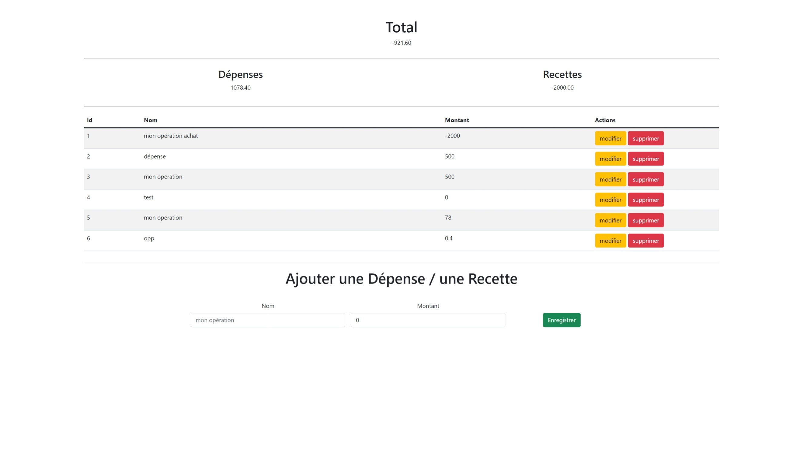

# Balance app

# Usage

The app uses the *bdd/db.json* file as database through an api simulated by **json-server**.

After you have clone the project, just run the  command `npm start` and head to the index.html.

## **(^^) !**
